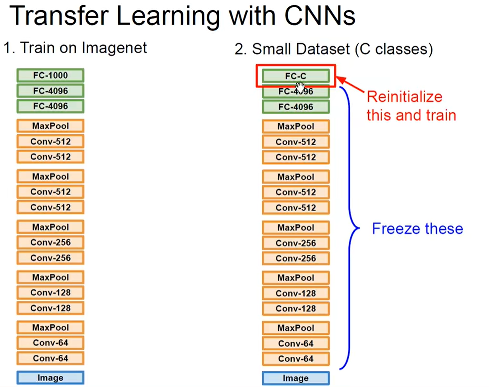

# Code


No Description.


## CS231n

### 线性分类器、线性评分函数、损失函数（多类支持向量机损失、Softmax分类器）

### 交叉验证方法

### 梯度、梯度下降方法（小批量梯度下降、随机梯度下降）、梯度更新（动量、Nestrov动量）

### 学习率退火（随机步衰减、指数衰减、1/t衰减）

### 逐参数适应学习率方法（Adagrad、RMSprop、Adam）

### 前向传播与反向传播过程

### 计算图导数计算过程

### 常用激活函数（Sigmoid、Tanh、ReLU、Leaky ReLU）

### 梯度消失/梯度爆炸

### 数据预处理（均值减法、归一化、PCA、白化）

### 权重初始化方法

1.   **零初始化（Zero Initialization）**：
     -    将所有权重初始化为零。
     -    **问题**：每个神经元的权重都相同，可能导致模型对称性问题，不利于模型学习。
2.   **随机初始化（Random Initialization）**：
     -    将权重初始化为随机数，通常服从均匀分布或正态分布。
     -    **均匀分布初始化**：权重在某个范围内随机选择，如 [-r, r]，r 是根据神经元数量和输入特征数量计算得出。
     -    **正态分布初始化**：权重从均值为 0，标准差为 σ 的正态分布中随机选择。常见的一种形式是 Xavier 初始化，其标准差为 ( \sqrt{\frac{2}{n_{in} + n_{out}}} )，其中 ( n_{in} ) 是输入神经元的数量， ( n_{out} ) 是输出神经元的数量。
3.   **Xavier 初始化（Xavier Initialization）**：
     -    也称为Glorot初始化。
     -    适用于常见的激活函数如tanh和sigmoid。
     -    保证了每一层的输入与输出的方差一致，有助于避免梯度消失或爆炸问题。
4.   **He 初始化（He Initialization）**：
     -    适用于ReLU激活函数及其变种。
     -    权重初始化为 ( \sqrt{\frac{2}{n_{in}}} )，其中 ( n_{in} ) 是输入神经元的数量。
     -    更好地适应了ReLU非线性激活函数的特性，有助于提升模型的性能。

### 批量归一化方法

在每一层的输入之前，对数据进行归一化处理，然后再通过可学习的变换重新缩放和平移数据。以下是批量归一化方法的关键点和作用：

1.   **归一化过程**：
     -    对于每个批次的输入，计算其均值和方差。
     -    对输入进行归一化，使得输入的均值为0，方差为1：[$ \hat{x} = \frac{x - \mu}{\sqrt{\sigma^2 + \epsilon}}$ ] 其中，( x ) 是输入，( $\mu$ ) 是均值，( $\sigma^2$ ) 是方差，( $\epsilon$ ) 是一个小的常数（通常为避免除以零而加入的，如 ( $10^{-5}$ )）。
     -    对归一化后的数据进行缩放和平移：[$ y = \gamma \hat{x} + \beta$ ] 其中，($ \gamma$ ) 和 ( $\beta $) 是可学习的参数，分别用于缩放和平移归一化后的数据。
2.   **作用**：
     -    **加速收敛**：批量归一化有助于加速神经网络的训练过程，因为它减少了内部协变量转移（Internal Covariate Shift），使得每一层的输入分布更加稳定，从而加速收敛。
     -    **减少梯度消失/爆炸问题**：归一化确保每层输入具有相似的范围，有助于避免深层网络中梯度消失或爆炸的问题。
     -    **正则化效果**：由于在每个批次中对数据进行归一化，批量归一化可以部分替代传统的正则化技术，如Dropout，因为它在一定程度上减少了神经网络对输入数据分布的依赖性。
3.   **适用范围**：
     -    批量归一化通常在卷积神经网络（CNNs）和深度全连接神经网络中广泛使用，特别是在深层网络或复杂任务中，效果显著。
     -    在训练和测试过程中的应用方式略有不同，通常在训练阶段根据当前批次计算均值和方差，并在测试阶段使用整个训练集的统计数据来归一化。

### 正则化（L1、L2、最大范式约束、随机失活、数据增强、早停法）

```为什么正则化有利于防止过拟合？```

1.   **降低模型复杂度**：正则化通过向损失函数添加惩罚项，使得模型倾向于选择简单的权重配置。例如，L1正则化和L2正则化分别向损失函数添加权重的绝对值和平方的惩罚项。这些惩罚项促使模型学习较小的权重值，从而减少模型的复杂度，防止模型对训练数据中的噪声过度拟合。
2.   **减少权重间的共同波动**：L2正则化（权重衰减）对权重施加惩罚，使得权重值不会过大，从而减少权重之间的共同波动。这有助于防止特定权重值过度适应训练集中的噪声或异常值，提高模型的泛化能力。
3.   **控制权重更新的幅度**：随机失活（Dropout）是一种随机地在训练过程中关闭神经元的技术。它迫使网络在不同的子集上进行训练，从而减少神经元对特定输入的依赖性，使得模型更加鲁棒，减少了过拟合的风险。
4.   **增强数据的多样性**：数据增强技术通过对训练数据进行随机变换（如旋转、缩放、翻转等），生成更多的训练样本。这样做可以提高模型对输入数据的鲁棒性，减少过拟合的可能性。
5.   **早停法（Early Stopping）**：早停法通过在验证集上监控模型性能，当模型在验证集上的性能停止提升时停止训练。这种方法有效防止了模型在训练集上过度拟合，因为一旦模型开始对验证集产生过拟合，训练就会停止，避免了进一步学习训练集中的噪声和细节。

### CNN的整体架构、运作方式

### 卷积层、感受野作用方式、填充方式、输出尺寸计算

### 汇聚层、归一化层、全连接层

### 经典卷积神经网络（LeNet、AlexNet、VGGNet、NiN、GoogleNet、ResNet、DenseNet、SENet）

### 全局平均池化、全局最大池化

### 迁移学习技术（Linear Probing、Fine-tuning）

>    1.   **Linear Probing**：
>         -    **定义**：在 Linear Probing 中，我们保持预训练模型的大部分参数不变，只对最后一层（通常是全连接层或分类器层）进行微调（fine-tuning）。然后，我们使用较小的学习率来训练整个模型，以便使最后一层适应新的任务。这个过程类似于训练一个新的分类器，但是使用了预训练模型的权重作为初始值。
>         -    **优势**：由于大部分模型参数被冻结，Linear Probing 对于小型数据集或相似任务的迁移非常有效。它可以在较短的时间内获得良好的性能，并且通常不需要大量的标注数据。
>         -    **适用场景**：适用于源数据集和目标数据集之间有一定相似性的情况，例如，在两个数据集中共享相似的低级特征，但具有不同的高级特征。
>    2.   **Fine-tuning**：
>         -    **定义**：Fine-tuning 是迁移学习中的一种常见方法，其中除了最后的分类层外，整个预训练模型的权重都被解冻，并与新的数据集一起进行训练。这意味着整个模型都会针对新任务进行微调。
>         -    **优势**：Fine-tuning 允许模型在新任务上进行更大程度的调整，因为整个模型的参数都可以通过训练来适应新的数据集。这对于新任务与源任务差异较大的情况可能更为适用，因为模型可以更自由地适应新的数据分布。
>         -    **适用场景**：适用于目标任务与源任务之间的差异较大，或者目标数据集非常大的情况。Fine-tuning 通常需要更多的数据和计算资源，但在适当的情况下，它可以产生更好的性能。
>
>    总的来说，Linear Probing 适用于相似任务和较小的数据集，而 Fine-tuning 更适用于任务差异较大或数据集规模较大的情况。




1.   冻结前面层的结构和权重，训练自己的输出层
2.   以预训练模型的权重作为数据集训练的权重初始化
3.   曲线救国：大数据集训练，对模型进行迁移学习和微调，泛化到小数据集上


>    cs224w图神经网络


### 一些工程实践技巧

1.   多个小卷积核堆叠代替大卷积核，参数更少，表示能力更强
2.   卷积运算：im2col：卷积计算转换为矩阵运算、快速傅里叶变换


>    通道注意力机制（Channel Attention Mechanism）和空间注意力机制（Spatial Attention Mechanism）是深度学习中用于增强模型性能的两种注意力机制的变体。
>
>    ### 1. 通道注意力机制（Channel Attention Mechanism）
>
>    通道注意力机制主要关注于增强不同通道之间的特征表示。在卷积神经网络（CNN）中，特征图（feature map）由多个通道（channel）组成，每个通道对应着不同的特征。通道注意力机制的目的是通过学习来动态地调整每个通道的重要性，以增强有用的特征并抑制无用的特征，从而提高模型的表现。
>
>    通道注意力机制的典型实现包括使用全局平均池化（Global Average Pooling）来获取每个通道的全局特征重要性权重，然后利用这些权重来重新加权特征图的每个通道。这种方法使得模型能够更好地学习到不同通道之间的相关性，从而提升特征的表达能力。
>
>    ### 2. 空间注意力机制（Spatial Attention Mechanism）
>
>    空间注意力机制则侧重于增强特征图中不同空间位置的表示。在处理视觉任务时，不同位置的特征往往具有不同的重要性。例如，对于物体识别任务，物体通常位于图像的特定位置，而背景则可能位于其他位置。因此，空间注意力机制通过学习来自动关注图像中具有显著信息的位置，从而提高模型的感知能力和鲁棒性。
>
>    空间注意力机制的经典实现包括利用卷积操作生成空间注意力图（Spatial Attention Map），该图用于加权特征图中每个空间位置的特征表示。这种方法有助于模型更有效地利用图像中重要的局部信息，提升了模型对复杂场景和变化的适应能力。
>
>    ### 关系与应用
>
>    通道注意力机制和空间注意力机制通常可以结合使用，以增强模型在不同任务中的性能。例如，在图像分类任务中，可以同时使用通道注意力和空间注意力，以便模型能够更好地区分和识别图像中不同类别的对象，并提升分类精度。这些注意力机制也广泛应用于其他视觉任务，如目标检测、语义分割等领域，以及自然语言处理领域的文本编码和解码中，用来增强模型对输入序列中不同部分的关注度，从而提升模型的性能和泛化能力。


### SENet 通道注意力机制

>    SENet（Squeeze-and-Excitation Network）是一种经典的深度神经网络架构，旨在通过引入通道注意力机制来增强模型对特征的表达能力。SENet最初由Jie Hu等人于2018年提出，并在ImageNet数据集上取得了显著的性能提升。
>
>    ### 结构和工作原理
>
>    SENet的核心创新在于引入了所谓的“Squeeze-and-Excitation”模块，该模块可以动态地学习每个通道的重要性权重，并利用这些权重来重新加权特征图的每个通道，从而增强有用的特征并抑制无用的特征。
>
>    #### Squeeze 操作：
>
>    首先，SENet通过全局平均池化（Global Average Pooling）操作，将特征图的每个通道进行全局池化，得到每个通道的全局特征描述。假设输入的特征图大小为($ H \times W \times C $)，其中 ( C ) 是通道数，全局平均池化后得到大小为 ($ 1 \times 1 \times C$) 的特征向量。
>
>    #### Excitation 操作：
>
>    然后，利用一个小型的全连接网络（一般是一个多层感知机，MLP），来对这个全局特征向量进行建模，学习得到每个通道的权重。这个全连接网络一般包括一个隐藏层（称为“squeeze”层）和一个sigmoid激活函数的输出层（称为“excitation”层），它的输出大小也是 ( $1 \times 1 \times C$ )，表示每个通道的重要性权重。
>
>    #### Scale 操作：
>
>    最后，将这些权重乘以对应的原始特征图上的每个通道，从而得到加权后的特征表示。这一过程称为“scale”，它有效地增强了重要特征通道的表示能力，减少了无关通道的干扰。
>
>    ### 应用和优势
>
>    SENet的主要优势在于引入了轻量级的通道注意力机制，相比于传统的CNN结构，它能够显著地提升模型在各种视觉任务上的性能。SENet不仅在图像分类任务中表现突出，在目标检测、语义分割等任务中也有显著的应用。其设计简单而有效，能够通过简单地添加SE模块到现有的网络结构中，就能够大幅度提升模型的表现，而无需过多增加计算成本或参数量。

、


### 全局平均池化（Global Average Pooling）

**输入**：

-    输入是一个特征图（feature map），通常是一个三维张量，其维度为 ( $W \times H \times C$ )，其中：
     -    ( W ) 是特征图的宽度（width），
     -    ( H ) 是特征图的高度（height），
     -    ( C ) 是特征图的通道数（number of channels）。

**操作过程**：

-    对每个通道 ( c ) 来说，全局平均池化会计算该通道上所有位置的特征值的平均值。

**输出**：

-    输出是一个具有 ( C ) 个通道的一维向量，每个通道的值是对应通道上所有元素的平均值。因此，输出的维度为 ( $1 \times 1 \times C$ )，通常可以看作是长度为 ( C ) 的特征向量。

### 全局最大池化（Global Max Pooling）

**输入**：

-    同样地，输入是一个特征图，维度为 ( $W \times H \times C$ )。

**操作过程**：

-    对于每个通道 ( c )，全局最大池化操作会选取该通道上所有位置的特征值的最大值作为该通道的输出值。

**输出**：

-    输出是一个具有 ( C ) 个通道的一维向量，每个通道的值是对应通道上所有元素的最大值。因此，输出的维度同样为 ( $1 \times 1 \times C$ )，即长度为 ( C ) 的特征向量。

### 总结

-    **全局平均池化的输出**是特征图每个通道的平均值，形状为 ( $1 \times 1 \times C$ )。
-    **全局最大池化的输出**是特征图每个通道的最大值，形状也为 ( $1 \times 1 \times C$ )。

>    全局平均池化（Global Average Pooling）和全局最大池化（Global Max Pooling）是在深度学习中常用的池化操作，通常用于减少特征图的空间维度，从而减少模型参数和计算量，并且有助于提取更加全局的特征信息。
>
>    1.   **全局平均池化（Global Average Pooling）**：
>         -    全局平均池化是对整个特征图进行求平均值操作，得到一个单独的值或特征向量。具体来说，对于一个输入特征图，全局平均池化将特征图中每个通道的所有元素求平均，最终得到每个通道的一个平均值。这样，无论输入的特征图大小如何，输出的特征图大小都会被压缩为一个固定大小（通道数不变，通常为1）的特征向量。
>         -    全局平均池化的优点是，它不仅可以减少参数数量和计算量，还可以提取整个特征图的全局信息，有助于提高模型的泛化能力。
>    2.   **全局最大池化（Global Max Pooling）**：
>         -    全局最大池化与全局平均池化类似，但它是对整个特征图进行最大值池化操作。也就是说，它会从每个通道的所有元素中选择最大值作为该通道的输出。因此，与全局平均池化不同，全局最大池化提取的是每个通道的最显著特征。
>         -    全局最大池化同样可以将整个特征图压缩为固定大小的特征向量，但相对于全局平均池化，它更加强调图像中存在的显著特征，可能更适合于某些任务，如物体检测或局部特征的捕捉。


# GoogLeNet


### 1×1卷积

1x1卷积在深度学习中有几个重要的作用和应用场景：

1.   **降维和升维**：
     -    1x1卷积可以用来调整特征图的深度（通道数）。通过选择合适的卷积核数量，可以增加或减少特征图的通道数。这种功能对于减少模型复杂度、降低计算成本非常有用，特别是在需要在不同层次上进行特征融合或重建时。
2.   **非线性变换**：
     -    虽然1x1卷积的感受野非常小（仅涉及单个像素），但它仍然能够引入非线性，通过激活函数如ReLU，它可以学习到复杂的非线性变换。
3.   **特征融合**：
     -    1x1卷积可以将不同特征图之间的信息进行融合。在卷积神经网络中，不同通道的特征图可以包含不同的信息，1x1卷积可以将这些信息进行整合，生成更有表达力的特征图。
4.   **改变特征图的维度**：
     -    通过适当调整1x1卷积的卷积核数量，可以改变特征图的维度，例如将输入特征图的通道数增加或减少，从而使其与下一层的输入或输出特征图维度匹配。
5.   **网络压缩**：
     -    在一些需要轻量级模型的应用场景中，如移动端或嵌入式设备上的部署，可以使用1x1卷积来减少模型的参数数量和计算量，同时尽量保持模型的性能。

在升维时，我们通常使用1x1卷积来增加特征图的通道数。

```python
import torch
import torch.nn as nn

# 假设输入特征图的大小为 N x C x H x W，其中 N 是批量大小，C 是通道数，H 和 W 是高度和宽度
input_features = torch.randn(1, 3, 32, 32)  # 示例输入特征图，3个通道，32x32大小

# 定义一个1x1卷积层，将通道数增加到 10
conv1x1 = nn.Conv2d(in_channels=3, out_channels=10, kernel_size=1)

# 使用1x1卷积进行升维
output = conv1x1(input_features)
print("Output shape after 1x1 convolution:", output.shape)  # 输出形状为 [1, 10, 32, 32]
```

**原理解释**：

-    `nn.Conv2d(in_channels=3, out_channels=10, kernel_size=1)`：这里定义了一个1x1的卷积层，输入通道数 `in_channels=3`（假设输入有3个通道），输出通道数 `out_channels=10`（希望输出特征图有10个通道），卷积核大小为1x1。
-    在这个例子中，输入的特征图大小为 [1, 3, 32, 32]，经过1x1卷积后，输出的特征图大小为 [1, 10, 32, 32]，通道数由3增加到了10，高度和宽度保持不变。

#### 1x1卷积降维示例

在降维时，1x1卷积通常用于减少特征图的通道数。

```python
import torch
import torch.nn as nn

# 假设输入特征图的大小为 N x C x H x W，其中 N 是批量大小，C 是通道数，H 和 W 是高度和宽度
input_features = torch.randn(1, 10, 32, 32)  # 示例输入特征图，10个通道，32x32大小

# 定义一个1x1卷积层，将通道数减少到 5
conv1x1 = nn.Conv2d(in_channels=10, out_channels=5, kernel_size=1)

# 使用1x1卷积进行降维
output = conv1x1(input_features)
print("Output shape after 1x1 convolution:", output.shape)  # 输出形状为 [1, 5, 32, 32]
```

**原理解释**：

-    `nn.Conv2d(in_channels=10, out_channels=5, kernel_size=1)`：这里定义了一个1x1的卷积层，输入通道数 `in_channels=10`（假设输入有10个通道），输出通道数 `out_channels=5`（希望输出特征图有5个通道），卷积核大小为1x1。
-    在这个例子中，输入的特征图大小为 [1, 10, 32, 32]，经过1x1卷积后，输出的特征图大小为 [1, 5, 32, 32]，通道数由10减少到了5，高度和宽度保持不变。

#### 基本原理

1x1卷积的作用类似于全连接层中的线性变换（FC），但它是在空间维度上进行的。其原理可以总结如下：

-    **参数调整**：通过1x1卷积层，可以调整输入特征图的通道数（即深度）。在升维时，通过增加输出通道数，可以丰富和增强特征表示。在降维时，通过减少输出通道数，可以压缩和精简特征表示。
-    **计算效率**：与全连接层相比，1x1卷积的参数量更少，计算量更小，同时可以并行处理每个像素的通道，利于深度神经网络的训练和优化。


# NiN

NiN网络架构的关键思想包括：

1.   **使用MLPConv层**：NiN网络引入了称为MLPConv的新型卷积层。这些层由一个普通卷积层和两个1x1卷积层（即一个 1x1 卷积后接一个 ReLU 激活层）组成。这样的结构可以显著增加模型的非线性，使得模型更能够学习到更复杂的特征。
2.   **全局平均池化层**：在传统的CNN结构中，一般使用全连接层来进行特征的整合和分类，而NiN网络则是利用全局平均池化（Global Average Pooling），直接用平均特征来整合特征信息。
3.   **消除全连接层**：NiN网络通过全局平均池化层替代传统的全连接层，可以显著地减少网络的参数数量，从而降低过拟合的风险，并且也提升了计算的效率。


# DenseNet

### 关键特点和创新点：

1.   **密集连接（Dense Connections）**：
     -    在DenseNet中，每个层都与前面所有层直接连接。这种密集连接的结构使得网络中的每一层可以接收来自前面所有层的输入，并且将其输出传递给后续所有层。这种结构与传统的CNN不同，传统CNN中的各层之间只有相邻的连接。
     -    密集连接有助于解决深层网络中的梯度消失问题，因为每一层都可以直接访问来自较早层的梯度信息，从而更容易地进行梯度反向传播和训练。
2.   **稠密块（Dense Block）**：
     -    稠密块是DenseNet中的基本组成单元。每个稠密块由多个卷积层组成，每个卷积层后面紧跟着一个ReLU激活函数。稠密块内部的卷积层与前面所有层的输入直接连接，形成了密集连接。
     -    稠密块内部的卷积层通常使用较小的滤波器（如3x3）来提取特征，并且在每个卷积层之后都可以选择性地使用批量归一化（Batch Normalization）和Dropout来进一步提升网络的性能和鲁棒性。
3.   **过渡层（Transition Layer）**：
     -    稠密块之间的过渡层用来减少特征图的维度。过渡层通常包括一个1x1卷积层来减少特征图的数量，并且使用步长为2的平均池化来减少特征图的大小。这有助于控制模型的复杂度和计算成本，同时促进特征的压缩和重用。
4.   **全局池化和分类层**：
     -    在最后的稠密块之后，使用全局平均池化来获取整个特征图的平均值，然后连接一个全连接层用于分类。全局平均池化有助于减少参数数量，避免过拟合，并提高模型的泛化能力。


# ResNet


# VGG


# GoogLeNet


>    

## Inception-ResNet-v1

>    
>
>    
>
>    


### 深度可分离卷积 Xception


​	


### 分组卷积


### 逐点卷积


## Label Smoothing

普通的交叉熵损失函数在训练过程中会强制模型将预测的类别概率分布尽可能接近0或1，这可能导致模型对训练数据中的噪声过于敏感，从而影响泛化能力。

标签平滑的思想是：不要完全相信训练数据中的标签，而是将真实标签对应的概率值稍微减小，将这部分“平滑”到其他类别上，从而使得模型对噪声数据不那么敏感，同时能够更好地泛化到未见过的数据上。

>    

```python
import torch
import torch.nn as nn
import torch.nn.functional as F

class LabelSmoothingCrossEntropy(nn.Module):
    def __init__(self, epsilon=0.1):
        super(LabelSmoothingCrossEntropy, self).__init__()
        self.epsilon = epsilon
    
    def forward(self, output, target):
        num_classes = output.size(1)
        logprobs = F.log_softmax(output, dim=1)
        loss = -logprobs.gather(dim=1, index=target.unsqueeze(1))
        loss = loss.squeeze(1)
        smooth_loss = -logprobs.mean(dim=1)
        loss = (1.0 - self.epsilon) * loss + self.epsilon * smooth_loss
        return loss.mean()

# 示例用法
# 定义模型
class SimpleNN(nn.Module):
    def __init__(self):
        super(SimpleNN, self).__init__()
        self.fc1 = nn.Linear(784, 128)
        self.fc2 = nn.Linear(128, 10)
    
    def forward(self, x):
        x = x.view(-1, 784)
        x = torch.relu(self.fc1(x))
        x = self.fc2(x)
        return x

# 实例化模型和损失函数
model = SimpleNN()
criterion = LabelSmoothingCrossEntropy(epsilon=0.1)
optimizer = torch.optim.Adam(model.parameters(), lr=0.001)

# 在训练循环中使用该损失函数
def train(model, criterion, optimizer, train_loader, epochs=5):
    model.train()
    for epoch in range(epochs):
        running_loss = 0.0
        for inputs, targets in train_loader:
            optimizer.zero_grad()
            outputs = model(inputs)
            loss = criterion(outputs, targets)
            loss.backward()
            optimizer.step()
            running_loss += loss.item() * inputs.size(0)
        epoch_loss = running_loss / len(train_loader.dataset)
        print(f"Epoch {epoch+1}/{epochs}, Training Loss: {epoch_loss:.4f}")

# 训练模型
train(model, criterion, optimizer, train_loader)

```


# 知识蒸馏

教师网络与学生网络


---


https://blog.csdn.net/qq_30196905/article/details/127077318

https://blog.csdn.net/qq_30196905/article/details/126927395

https://blog.csdn.net/weixin_44791964/article/details/121371986

https://blog.csdn.net/qq_42864343/article/details/134722507


